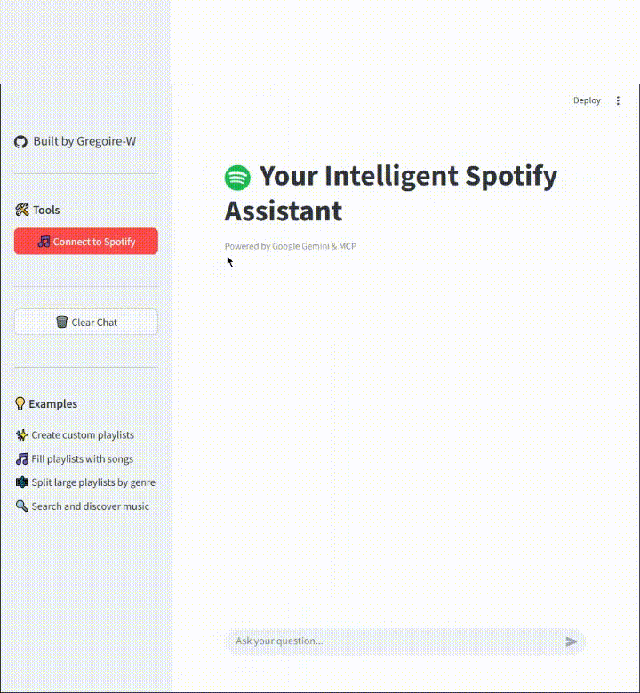

<div align="center">

# 🎵 Spotify MCP - Model Context Protocol Implementation

[](https://github.com/modelcontextprotocol)
[](https://www.typescriptlang.org/)
[](https://www.python.org/)
[](https://www.docker.com/)
[](https://streamlit.io/)
[](LICENSE)

**Create entire Spotify playlists with a single prompt or split large playlists by music genre using AI.**

[Features](#-features) • [Demo](#-demo) • [Quick Start](#-quick-start) • [Architecture](#-architecture) • [Documentation](#-documentation)

</div>

---

## 📖 About The Project

**Spotify MCP** is a practical implementation of the **Model Context Protocol (MCP)** that showcases how AI assistants can interact with external services in a standardized way. This project uses Spotify as a real-world example to demonstrate MCP's capabilities.

### What is Model Context Protocol?

The Model Context Protocol is an open standard that enables AI models to securely connect to external data sources and tools. Instead of AI models having hardcoded integrations, MCP provides a universal way for them to interact with any service.

```
┌─────────────────┐
│   AI Model      │
│   (Gemini)      │
└────────┬────────┘
         │
         │ MCP Protocol
         │
┌────────▼────────┐
│   MCP Server    │◄──── Standardized Interface
│   (Spotify)     │
└────────┬────────┘
         │
         │ REST API
         │
┌────────▼────────┐
│  Spotify API    │
└─────────────────┘
```

**Why this project matters:**
- 🎓 **Educational**: Learn MCP by building something practical
- 🔌 **Reusable**: Server architecture can be adapted for other APIs
- 🚀 **Production-ready**: Docker-based deployment with TypeScript & Python
- 💡 **Real-world use case**: Solve actual Spotify playlist management challenges

---

## ✨ Features

### 🎼 Playlist Creation
- **Natural Language Playlists**: Generate entire playlists from a single prompt
  - *"Create a workout playlist with 20 high-energy songs"*
  - *"Make me a chill jazz playlist for studying"*
  
### 🎯 Smart Track Search
- Search Spotify's catalog using conversational language
- Get track details including URI, artists, and album info

### 📝 Playlist Management
- Create public or private playlists
- Add multiple tracks in bulk operations
- Full control over playlist metadata

### 🎨 Genre-Based Organization
- **Coming Soon**: Split large playlists by music genre
- Organize your library intelligently

---

## 🎬 Demo

<div align="center">

### Creating a Playlist in Seconds



*A complete playlist created with natural language in one prompt*

</div>

---

## 🚀 Quick Start

### Prerequisites

Before you begin, make sure you have:

1. **Docker & Docker Compose** installed ([Get Docker](https://docs.docker.com/get-docker/))
2. **Spotify Developer Account** - [Create App Tutorial](#spotify-setup)
3. **Google Gemini API Key** - [Get Free Key](https://ai.google.dev/)
4. **Active Spotify Account** for testing

### Spotify Setup

1. Go to [Spotify Developer Dashboard](https://developer.spotify.com/dashboard)
2. Click **"Create an App"**
3. Fill in the app details:
   - **App Name**: MCP Spotify (or any name)
   - **App Description**: Model Context Protocol implementation
   - **Redirect URI**: `http://localhost:8080`
4. Save and copy your **Client ID** and **Client Secret**

### Installation

```bash
# 1. Clone the repository
git clone https://github.com/Gregoire-W/mcp-spotify.git
cd mcp-spotify

# 2. Configure MCP Server environment
cd mcp-server
echo "SPOTIFY_CLIENT_ID=your_client_id_here" > .env
echo "SPOTIFY_CLIENT_SECRET=your_client_secret_here" >> .env
cd ..

# 3. Configure MCP Client environment
cd mcp-client
echo "GOOGLE_GENAI_API_KEY=your_gemini_api_key_here" > .env
echo "SPOTIFY_CLIENT_ID=your_client_id_here" >> .env
cd ..

# 4. Launch with Docker Compose
docker compose up --build

# 5. Open your browser
# Navigate to: http://localhost:8080
```

### First Run

1. Open `http://localhost:8080` in your browser
2. The Streamlit interface will load
3. Click the **"Connect to Spotify"** button in the sidebar to authenticate
4. Once connected, start chatting! Try: *"Create a playlist called 'Road Trip' with 15 upbeat songs"*

---

## 🏗️ Architecture

### Technology Stack

<div align="center">

| Component | Technology | Purpose |
|-----------|-----------|---------|
| **MCP Server** | TypeScript + Express | Implements MCP protocol & Spotify integration |
| **MCP Client** | Python | Handles MCP client communication |
| **AI Model** | Google Gemini 2.5 Flash | Natural language processing & tool calling |
| **UI** | Streamlit | Simple, effective chat interface |
| **Deployment** | Docker Compose | Containerized multi-service architecture |

</div>

### System Architecture

```
┌──────────────────────────────────────────────────────────┐
│                      User Interface                       │
│                   Streamlit (Port 8080)                   │
└───────────────────────────┬──────────────────────────────┘
                            │
                    ┌───────▼────────┐
                    │  MCP Client    │
                    │   (Python)     │
                    │                │
                    │  • Session     │
                    │  • Gemini API  │
                    └───────┬────────┘
                            │ MCP Protocol
                            │ (HTTP)
                    ┌───────▼────────┐
                    │  MCP Server    │
                    │  (TypeScript)  │
                    │                │
                    │  Tools:        │
                    │  • createPlaylist
                    │  • searchTracks
                    │  • addTrack    │
                    └───────┬────────┘
                            │ OAuth 2.0
                            │ REST API
                    ┌───────▼────────┐
                    │  Spotify API   │
                    └────────────────┘
```

### MCP Tools Implementation

The server exposes three main tools through the MCP protocol:

#### 1. `createPlaylist`
```typescript
Input: {
  playlistName: string
  playlistDescription: string
  isPublic: boolean
}
Output: {
  success: boolean
  playlistId: string
  message: string
}
```

#### 2. `searchTracks`
```typescript
Input: {
  query: string
}
Output: {
  tracks: [{
    uri: string
    name: string
    artists: string[]
    album: string
  }]
  success: boolean
}
```

#### 3. `addTrackToPlaylist`
```typescript
Input: {
  playlistId: string
  uris: string[]
}
Output: {
  success: boolean
  message: string
}
```

---

## 🔧 Configuration

### Environment Variables

#### MCP Server (`mcp-server/.env`)
```env
SPOTIFY_CLIENT_ID=your_spotify_client_id
SPOTIFY_CLIENT_SECRET=your_spotify_client_secret
```

#### MCP Client (`mcp-client/.env`)
```env
GOOGLE_GENAI_API_KEY=your_gemini_api_key
SPOTIFY_CLIENT_ID=your_spotify_client_id
```

### Upgrading AI Power

The project uses **Gemini 2.5 Flash** (free tier) by default. For better performance:

1. Upgrade to **Gemini 2.5 Pro** in `mcp-client/client.py`:
```python
response = self.client.models.generate_content(
    model="gemini-2.5-pro",  # Changed from gemini-2.5-flash
    contents=self.messages,
    config=config,
)
```

2. Other compatible models:
   - `gemini-2.5-pro`: Best quality, slower
   - `gemini-2.5-flash`: Balanced (default)
   - `gemini-2.0-flash-exp`: Fastest, experimental

---

## 📚 Documentation

### Project Structure

```
mcp-spotify/
├── mcp-server/              # TypeScript MCP Server
│   ├── src/
│   │   ├── index.ts         # Server entry point & tool registration
│   │   ├── clients/
│   │   │   └── spotifyApiClient.ts  # Spotify API wrapper
│   │   └── types/
│   │       └── track.ts     # TypeScript type definitions
│   ├── Dockerfile.prod
│   ├── package.json
│   └── tsconfig.json
│
├── mcp-client/              # Python MCP Client
│   ├── client.py            # MCP client implementation
│   ├── streamlit_app.py     # UI interface
│   ├── requirements.txt
│   └── Dockerfile.prod
│
└── docker-compose.yml       # Multi-container orchestration
```

### Development

#### Running Locally (without Docker)

**Server:**
```bash
cd mcp-server
npm install
npm run build
node build/index.js
```

**Client:**
```bash
cd mcp-client
pip install -r requirements.txt
streamlit run streamlit_app.py --server.port 8080
```

#### Testing MCP Server

Use the MCP Inspector to test your server:
```bash
npx @modelcontextprotocol/inspector http://localhost:3000/mcp
```

---

## 🤝 Contributing

Contributions are what make the open-source community amazing! Any contributions you make are **greatly appreciated**.

1. Fork the Project
2. Create your Feature Branch (`git checkout -b feature/AmazingFeature`)
3. Commit your Changes (`git commit -m 'Add some AmazingFeature'`)
4. Push to the Branch (`git push origin feature/AmazingFeature`)
5. Open a Pull Request

---

## 🐛 Troubleshooting

### Common Issues

**Port Already in Use**
```bash
# Change ports in docker-compose.yml
ports:
  - "8081:8080"  # Use 8081 instead of 8080
```

**Spotify Authentication Failed**
- Verify your Client ID and Client Secret in `.env`
- Ensure Redirect URI is set to `http://localhost:8080` in Spotify Dashboard
- Check that you've authorized the app during first run

**Docker Build Fails**
```bash
# Clean Docker cache and rebuild
docker compose down
docker system prune -a
docker compose up --build
```

---

## 📝 License

Distributed under the MIT License. See `LICENSE` for more information.

---

## 🙏 Acknowledgments

- [Model Context Protocol](https://modelcontextprotocol.io/) - The MCP specification and SDK
- [Anthropic](https://www.anthropic.com/) - For creating and maintaining MCP
- [Spotify Web API](https://developer.spotify.com/documentation/web-api) - Music data and controls
- [Google Gemini](https://ai.google.dev/) - AI model with function calling
- [Streamlit](https://streamlit.io/) - Rapid UI prototyping

---

## 📧 Contact

Grégoire W. - [@Gregoire-W](https://github.com/Gregoire-W)

Project Link: [https://github.com/Gregoire-W/mcp-spotify](https://github.com/Gregoire-W/mcp-spotify)

---

<div align="center">

**⭐ Star this repo if you find it helpful!**

Made with ❤️ and lots of ☕

</div>
